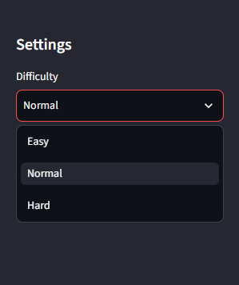
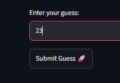
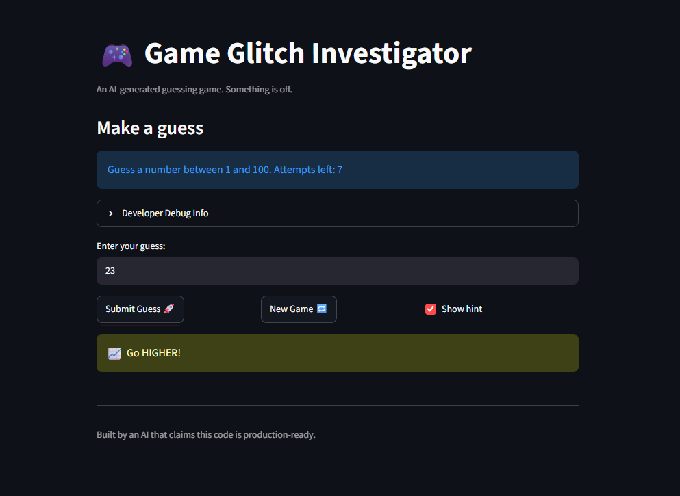
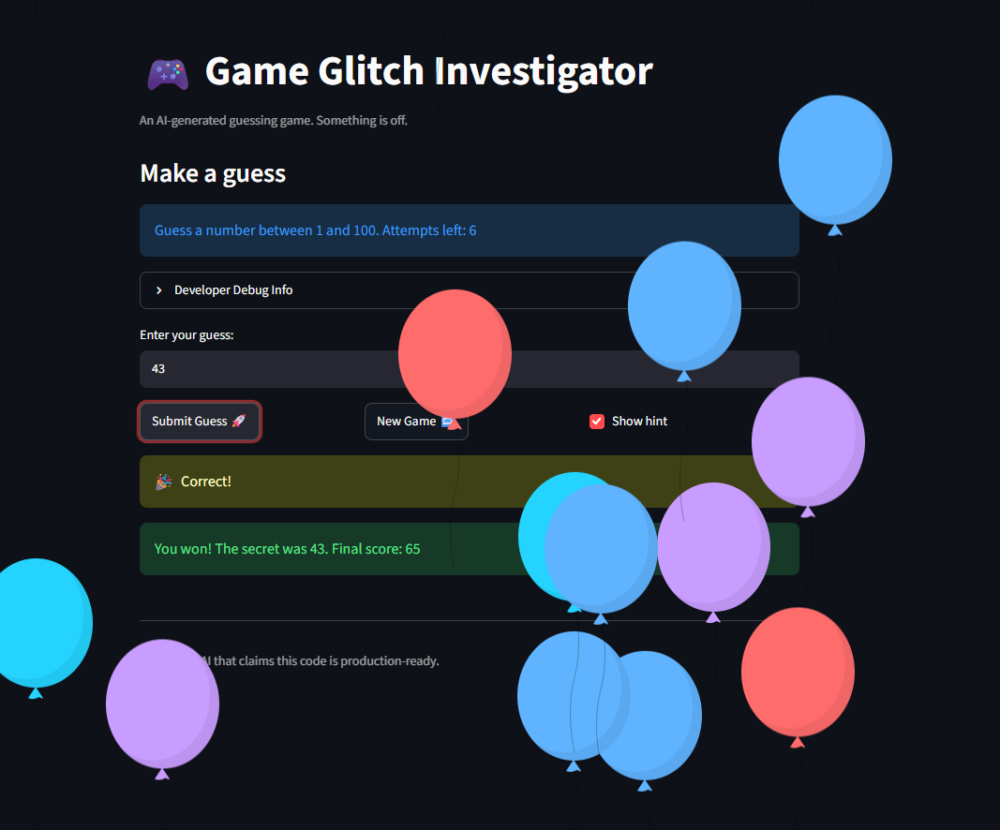

# 🎮 Game Glitch Investigator: The Impossible Guesser

## 🚨 The Situation

You asked an AI to build a simple "Number Guessing Game" using Streamlit.
It wrote the code, ran away, and now the game is unplayable. 

- You can't win.
- The hints lie to you.
- The secret number seems to have commitment issues.

## 🛠️ Setup

1. Install dependencies: `pip install -r requirements.txt`
2. Run the broken app: `python -m streamlit run app.py`

## 🕵️‍♂️ Your Mission

1. **Play the game.** Open the "Developer Debug Info" tab in the app to see the secret number. Try to win.
2. **Find the State Bug.** Why does the secret number change every time you click "Submit"? Ask ChatGPT: *"How do I keep a variable from resetting in Streamlit when I click a button?"*
3. **Fix the Logic.** The hints ("Higher/Lower") are wrong. Fix them.
4. **Refactor & Test.** - Move the logic into `logic_utils.py`.
   - Run `pytest` in your terminal.
   - Keep fixing until all tests pass!

## 📝 Document Your Experience

- [x] Describe the game's purpose.
- [x] Detail which bugs you found.
- [x] Explain what fixes you applied.

### 🎯 Game Purpose

The game's purpose is a number guessing game. The game has a secret number, and you need to guess it. The game picks a number automatically and gives you a place where you can enter your input. If the input you entered matches the secret number, you win, but if it doesn't, the game shows you feedback to make guessing easier for you. If the number you guessed is bigger than the secret, it tells you to go lower, but if the number you picked is lower than the secret number, it tells you to go higher so you can guess it. If you run out of attempts before guessing the secret number, you lose.

The game also has a score. You get points when you win, and you get more points if you win in fewer attempts, but you lose points for every wrong guess.

The game has 3 types of difficulty, Easy, Normal and Hard, and each mode has its own limitations and features.

### 🐞 Bugs I Found

**1. The hints are inverted**
The "Go Higher" and "Go Lower" hints are reversed. When my guess was too high, the game told me to go higher, and when it was too low, it told me to go lower.

**2. The game ends one attempt early**
The game told me I was out of attempts while I still had one try left.

**3. New Game doesn't fully reset the game**
I started a new game and clicked "New Game" before running out of attempts. All 8 attempts came back and the secret number changed, but the guess history from the previous game was still there. Starting a new game should clear the old history.

**4. Out-of-range numbers are accepted**
I entered very large and negative numbers, like "43095702347873234" and "-24356452054095". Instead of showing an error, the game treated them as normal guesses and gave me "Go Higher" or "Go Lower" hints. It should reject any number outside the allowed range.

**5. Invalid input uses up an attempt**
When I typed letters ("kfadjgdfghf"), the game correctly showed "That is not a number." However, it still counted that as one of my attempts. Invalid input shouldn't cost an attempt.

**6. The game can't be restarted after a win**
After I won, the game showed "You already won. Start a new game to play again." When I clicked "New Game", the attempts reset to 8 (Normal mode) and a new secret number appeared, but the game still didn't work:
- The previous game's history wasn't cleared.
- Entering a guess did nothing.

The game stays stuck, and the only way to play again is to refresh the page.

### 🛠️ Fixes I Applied

- **Inverted hints (bug 1):** swapped the "Go Higher" / "Go Lower" messages in `check_guess`, and stopped turning the secret into text on even attempts, so the hints are now always correct.
- **One attempt missing (bug 2):** the attempt counter now starts at `0` instead of `1`, so each mode gives its full number of attempts.
- **Out-of-range numbers (bug 4):** guesses are now checked against the mode's range. Numbers outside it show "Out of range. Please enter a number between 1 and 100." (or the range of the selected mode) and don't cost an attempt.
- **Invalid input (bug 5):** an attempt is now only counted after the input is confirmed to be a valid number.

**Extra fixes I found along the way:**
- Decimals like `50.5` are no longer cut down to `50`; they show "Please enter a whole number."
- Changing the difficulty now starts a new game with a secret inside the new range.
- The "Attempts left" number now updates right after each guess instead of one click late.

**Not fixed yet:** bugs 3 and 6 (the "New Game" button doesn't clear the history or reset the game after a win).

More details, with the code before and after each fix, are in `reflection.md`.

## 📸 Demo Walkthrough

Describe your fixed game in numbered steps so a reader can follow along without watching a video:

1. Open the app.
2. Select a difficulty: **Easy** (1 to 20), **Normal** (1 to 100) or **Hard** (1 to 50). Each mode has its own number of attempts.
3. The game automatically picks a secret number within the range of the selected difficulty.
4. Enter a whole number in the **Enter your guess** field and click **Submit Guess**.
5. If you enter letters, a decimal, or a number outside the range, the game shows an error message, and it does not cost you an attempt.
6. If your guess is too high, the game tells you to go lower. If it is too low, it tells you to go higher.
7. Keep guessing and following the feedback.
8. If you guess the secret number, you win. If you run out of attempts, you lose.
9. Click **New Game** to start a new game.

**Screenshots:**

**1. Choose a difficulty**



**2. Enter a guess**



**3. Get the feedback**



**4. Win the game**



## 🧪 Test Results

```
(.venv) PS C:\Users\user4\Desktop\ai110-module1show-gameglitchinvestigator-starter> python -m pytest
================================================================== test session starts ==================================================================
platform win32 -- Python 3.13.15, pytest-9.1.1, pluggy-1.6.0
rootdir: C:\Users\user4\Desktop\ai110-module1show-gameglitchinvestigator-starter
plugins: anyio-4.15.1
collected 3 items

tests\test_game_logic.py ...                                                                                                                       [100%]

=================================================================== 3 passed in 0.02s ===================================================================
```

## 🚀 Stretch Features

- [ ] [If you choose to complete Challenge 4, describe the Enhanced UI changes here — a screenshot is optional]
